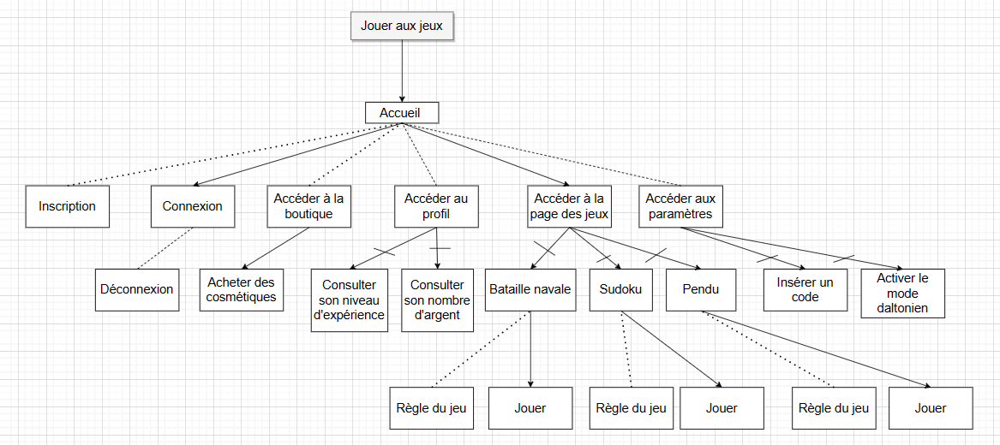

<h1>Projet Web Javascript</h1>

<h2>Objectif</h2>

Avoir un site internet fonctionnel qui devra contenir des éléments de base.
C'est-à-dire pouvoir se connecter, et avoir plusieurs jeux auxquels on peut y jouer.
Les jeux disponibles seront le Sudoku, la Bataille Navale et le Pendu.

<h2>Les Jeux</h2>
<h3>Le Pendu</h3>
<h4>Règles du jeu</h4>

Le jeu du pendu consiste à trouver un mot généré aléatoirement selon la difficulté.
Le joueur aura un certain nombre de vies pour trouver celui-ci en citant des lettres.
Lorsque l’utilisateur pense avoir le mot, il peut tenter sa chance, s'il échoue alors, il perdra une vie.

<h4>Difficultés</h4>

La difficulté sera changée selon le niveau de l’utilisateur. 
La difficulté sera modifier par la longueur des mots, la difficulté de trouver certaines lettres,
une réduction de temps pour trouver le mot, des mots composés, 
le joueur ne sera pas combien il y a de lettre dans le mot et l’utilisateur aura moins de vies pour trouver le mot.

<h4>Scores</h4>

Il y aura un système de niveau. Selon la difficulté, 
le joueur gagnera de l'expérience selon une victoire ou une défaite. 
De plus, plus l’utilisateur joue, plus il aura de difficulté.

<h4>Succès</h4>
<ul>
    <li>Gagner une partie pour la première fois.</li>
    <li>Gagner une partie en moins 30 secondes.</li>
    <li>Gagner une partie en trouvant toutes les lettres et le mot du premier coup.</li>
    <li>Gagner tous les succès en une partie.</li>
</ul>

<h3>Morpion</h3>
<h4>Règles du jeu</h4>

Le jeu  se joue seul, il se joue en 1 versus 1 contre un bot Aléatoire/bot Intelligent.
Les joueurs doivent aligner leurs symboles, croix ou rond que ce soit verticale,horizontale
ou en diagonale. Le joueur ayant aligné en premier ses symboles gagne la partie. La partie 
se finit si toutes les cases sont remplies et qu’aucun joueur n’ayant réussi à aligner ses symboles. 

<h4>Difficultés</h4>
<ul>
    <li><strong>Facile</strong></li>
    <ul>
        <li>Le joueur joue contre le bot aléatoire.</li>
        <li>Le joueur joue sur une grille 3x3.</li>
        <li>Le joueur a une limite de temps de 10 secondes pour placer un symbole.</li>
    </ul>
    <li><strong>Moyen</strong></li>
    <ul>
        <li>Le joueur joue contre le bot aléatoire.</li>
        <li>Le joueur joue sur une grille en 4x4.</li>
        <li>Le joueur a une limite de temps de 8 secondes pour placer un symbole.</li>
    </ul>
    <li><strong>Intermediaire</strong></li>
    <ul>
        <li>Le joueur joue contre le bot intelligent.</li>
        <li>Le joueur joue sur une grille 3x3.</li>
        <li>Le joueur a une limite de temps de 6 secondes pour placer un symbole.</li>
    </ul>
    <li>Difficile</li>
    <ul>
        <li>Le joueur joue contre le bot intelligent.</li>
        <li>Le joueur joue sur une grille en 4x4.</li>
        <li>Le joueur a une limite de temps de 4 secondes pour placer un symbole.</li>
    </ul>
</ul>
<h4>Scores</h4>

Les joueurs gagneront des points s'ils gagnent ou perdent selon la difficulté de la partie.

<h4>Succès</h4>
<ul>
    <li>Ils gagnent une partie en un temps définie.</li>
    <li>Ils font couler un bateau sans toucher une case “EAU”.</li>
    <li>Ils gagnent une partie avec la difficulté difficile.</li>
    <li>Ils ne se font pas couler un bateau.</li>
    <li>Ils essayent de tricher.</li>
</ul>

<h3>Sudoku</h3>
<h4>Règles du jeu</h4>

Chaque ligne, colonne et région de 9 cases ne doit contenir qu'une
seule fois tous les chiffres de un à neuf.

<h4>Difficultés</h4> 
<ul>
    <li><strong>Facile</strong></li>
    

    Beaucoup de chiffres sont remplis, le jeu est simple à remplir.
    

    <li><strong>Moyen</strong></li>
    

    Il faudra réfléchir pour réussir ce niveau, moins de chiffres apparaissent.
    

    <li><strong>Difficile</strong></li>
    

    Il faudra utiliser des techniques avancées afin de réussir ces niveaux.
     Les chiffres se font rares.
    

</ul>
<h4>Scores</h4>

A la victoire d’une partie, le joueur remporte 10 points d’expérience et gagne aussi une petite somme d’argent.
 Lors de la défaite, le joueur remporte 2 points d’expérience.
 Si la difficulté “difficile” est sélectionnée, les points de victoire sont doublés, mais lors de la défaite les points sont divisés par deux.

<h4>Succès</h4>
<ul>
    <li>Réussir 1 niveau de difficulté facile.</li>
    <li>Réussir 1 niveau de difficulté difficile</li>
    <li>Réussir 5 niveaux de difficulté facile.</li>
    <li>Réussir 5 niveaux de difficulté difficile.</li>
</ul>

<h3>Solitaire</h3>
<h4>Règles du jeu</h4>
<ul>
<h5>Objectif</h5>

Le but principal du Solitaire est de déplacer toutes les cartes vers quatre
fondations, classées par couleur et en ordre croissant, commençant par l'As et se terminant par le Roi.

<h5>Déroulement du jeu</h5>

Déplacez les cartes entre les colonnes en dévoilant les cartes cachées.
Vous pouvez déplacer les cartes en les plaçant sur une carte immédiatement supérieure dans une colonne voisine et de couleur opposée.
Vous pouvez déplacer une séquence de cartes si elles sont en ordre décroissant.
 
Libérez une colonne en déplaçant une séquence de cartes face visible vers une colonne vide.

</ul>

<h4>Difficultés</h4>
<ul>
    <li><strong>Facile</strong></li>
    

    Jeu normal, disposition de cartes sans alterner les couleurs
    

    <li><strong>Moyen</strong></li>
    

    Jeu normal avec disposition des cartes en alternant les couleurs
    

    <li><strong>Difficile</strong></li>
    

    Fin du jeu en moins de 3 minutes
    

</ul>
<h4>Scores</h4>

On gagne des points à notre jeu du solitaire lorsque l'on effectue les actions suivantes :

<ul>
    <li>Vous retournez une carte du tableau : + 10 points.</li>
    <li>Vous déplacez une carte de la réserve vers le tableau : + 10 points.</li>
    <li>Vous placez une carte sur l’une des fondations : + 15 points.</li>
</ul>

Vous perdez des points lors de ces actions :

<ul>
    <li>Vous déplacez une carte des fondations vers le tableau : - 5 points.</li>
    <li>Vous annulez le dernier mouvement ou action de jeu : - 15 points.</li>
</ul>
<h4>Succès</h4>
<ul>
    <li>Un succès gagné pour chaque niveau de jeu réussi.</li>
</ul>

<h2>Personas</h2>
<table id="personas">
    <tr id="ligne_rene">
        <td>
          
        Identification : René. 
        Âge : 73 ans. 
        Situation : Veuf. 
        Domicile : Tours. 
         
        Bio :  
        Homme âgé à la retraite, cherche à se divertir pendant ses journées lors de sa retraite.
        </td>
        <td>
        Attentes :  
        <ul>
            <li>Pouvoir acheter des éléments dans une boutique.</li>
            <li>Ne pas avoir de limite de temps pour jouer.</li>
            <li>Pouvoir consulter son niveau d’expérience.</li>
        </ul>
        </td>
        <td>
        Frustrations :  
        <ul>
            <li>Ne pas bien voir à cause de son âge.</li>
            <li>Ne pas réussir à se retrouver sur les sites internet.</li>
            <li>Avoir plein de pop-up.</li>
        </ul>
        </td>
    </tr>
    <tr id="ligne_lucile">
        <td>
          
        Identification : Lucile. 
        Âge : 19 ans. 
        Situation : Célibataire. 
        Domicile : Dignes les bains. 
         
        Bio :  
        Étudiante en Art & Dessin, cherche à se divertir durant des cours ennuyant.
        </td>
        <td>
        Attentes :  
        <ul>
            <li>Être contraint par le temps.</li>
            <li>Avoir des premiers niveaux ultra simples pour être sûr 
            d’avoir compris les règles et ne pas perdre dès le début.</li>
            <li>Avoir un mode daltonien.</li>
        </ul>
        </td>
        <td>
        Frustrations :  
        <ul>
            <li>Ne pas pouvoir jouer avec des amis sur un ordinateur.</li>
            <li>Ne pas avoir plus de 2 difficultés.</li>
            <li>Elle se lasse facilement des apparences.</li>
        </ul>
        </td>
    </tr>
    <tr id="ligne_lucien">
        <td>
          
        Identification : Lucien. 
        Âge : 25 ans. 
        Situation : Marié. 
        Domicile : Paris. 
         
        Bio :  
        Il vient d’obtenir son diplôme de commerce, se considère comme un stratège.
        </td>
        <td>
        Attentes :  
        <ul>
            <li>Pouvoir trouver des easter eggs.</li>
            <li>Pouvoir avoir le ratio des parties jouées.</li>
            <li>Pouvoir lire les règles du jeu en jouant.</li>
        </ul>
        </td>
        <td>
        Frustrations :  
        <ul>
            <li>Souvent déçu des nouveaux jeux dits : “difficile”.</li>
            <li>Il a l’esprit critique, il n’aime pas ne pas pouvoir accès aux dernières maj.</li>
            <li>Il n’aime pas lorsqu’il y a trop de texte, et des règles de jeu compliqué.</li>
        </ul>
        </td>
    </tr>
    <tr id="ligne_veronique">
        <td>
          
        Identification : Véronique. 
        Âge : 48 ans. 
        Situation : Marié. 
        Domicile : Pau. 
         
        Bio :  
        Travaille dans la mairie de Pau depuis 28 ans,
        aime jouer à des jeux pendants ses pauses.
        </td>
        <td>
        Attentes :  
        <ul>
            <li>Pouvoir faire des parties rapides.</li>
            <li>Pouvoir s'améliorer grâce à des conseils en jeu.</li>
            <li>Pouvoir visionner son temps de jeu durant une partie.</li>
        </ul>
        </td>
        <td>
        Frustrations :  
        <ul>
            <li>N’aime pas les sites trop compliqués, préfère quand c’est concis.</li>
            <li>Elle n’aime pas perdre de temps, marre des publicités.</li>
        </ul>
        </td>
    </tr>
</table>

<h2>Explication des tâches</h2>

<strong>René souhaite jouer au sudoku.</strong> 
Pour ce faire, il accède à la page d’accueil du site. 
Il se connecte à son compte puis il clique sur Jeux.
Par la suite, il devra choisir le jeu Sudoku parmi les 3 jeux proposés.

<strong>René souhaite pouvoir accéder à la boutique.</strong>
Pour cela, il clique sur le bouton Boutique dans le fil d’ariane.
Il peut désormais choisir entre plusieurs éléments, qu’il pourra acheter s’il le souhaite grâce à son argent.

<strong>René souhaite accéder à son profil</strong> afin de consulter son expérience ainsi que son argent.
Il décide de cliquer sur le bouton Profil situé dans le fil d’ariane pour y parvenir.

<strong>Lucile souhaite jouer au pendu.</strong>
Pour cela, elle accède à la page d’accueil, se rend dans le menu jeux, puis elle choisit de jouer au pendu. 

<strong>Lucile souhaite activer le mode daltonien,</strong>
elle peut retourner à l’accueil puis se diriger sur paramètre,
elle pourra cocher l’option de mettre le mode daltonien.

<strong>Lucien souhaite jouer à la bataille navale.</strong>
Pour se faire, il accède à la page d’accueil, cliquez sur la partie jeux, puis sélectionne le jeu de la bataille navale.
Il aime ce type de jeu, facile à comprendre et très modelable. 

<strong>Lucien souhaite lire les règles de la bataille navale.</strong>
Pour cela, il accède à la page d’accueil, se rend sur la partie jeux, puis sélectionne le jeu de la bataille navale.
Il aura accès aux règles correspondant à la bataille navale.  

<strong>Veronique veut jouer au solitaire.</strong>
Pour ce faire, il accède à la page d’accueil, cliquez sur la partie
jeux, puis sélectionne le jeu solitaire.
Elle aime ce type de jeu, facile à comprendre et rapide.

<strong>Veronique souhaite voir son temps de jeu.</strong>
Elle pourra regarder son temps de jeu, en regardant dans le coin
en haut à droite de la page du jeu actuelle.

